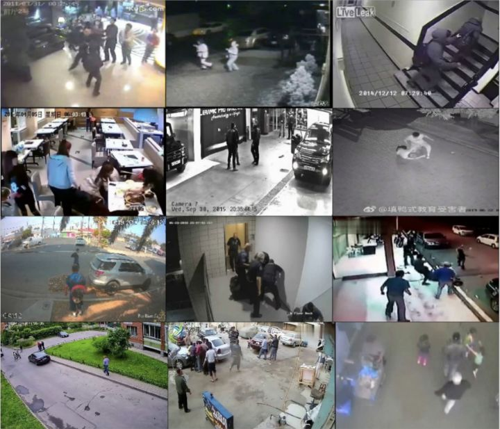
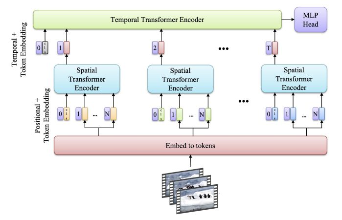

# Video Classification Project
Video classification is an important problem in computer vision and artificial intelligence, involving the automatic classification and labeling of videos based on content.The applications of video classification are diverse, from security and surveillance to improving content recommendation systems on video viewing platforms such as YouTube or Netflix, to analyzing user behavior and supporting automated-drive. To achieve high performance, video classification models need to 
be trained on large, diverse data sets and often have to handle challenges such as environmental fluctuations, camera angle changes, and background diversity. behavior and interaction in video.
## Dataset RWF2000 - violence detection
RWF2000 is a dataset on the problem of violence detection (detecting violent behavior), classifying videos based on two classes of fight or non-fight behavior corresponding to violent behavior in the video. Dataset includes 2000 videos, each video is 5 seconds long and recorded at 30 FPS corresponding to 300,000 frames.




## Data structure
```
       dataset/rwf-2000
           train/
               Fight/
                   video1/
                       frame1.jpg/
                           ...
                       frame30.jpg/
                   videoN/
               NonFight/
           val/
                Fight/
                NonFight/    
   ```
## Video ViT (ViViT)


